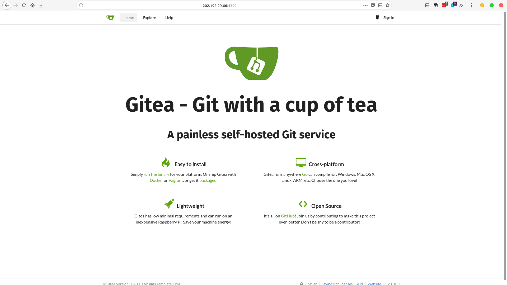

# Services

Some services provided here.

## Gitea

> **This is not a stable service.**

> Please do not use it for commercial projects. 
Important files need to be backed up.

### Address

`202.192.29.66:4399` 

### Environment
- Gitea: 1.4.2-1
- Sqlite3: 3.24.0-1
- Arch Linux: latest
- CPU: Intel Xeon E5606 (8) @ 1.196GHz 
- Memory: 296MiB / 7960MiB
- HDD: 70G*2

### Register

Send a message containing your username and email, and I will return an account with a random password at first. If you did not join our group, you can open an issue here.

## Arch Linux Packages Cache

This is a caching for archlinux packages. It contains **testing** or rebuilding packages. You need to pay attention to them.

The package will be signed by my keyring which one you can install `archlinuxcn-keyring` from archlinuxcn's mirror.
Then downloading the package to install.

### Address

`202.192.29.66:8201` 